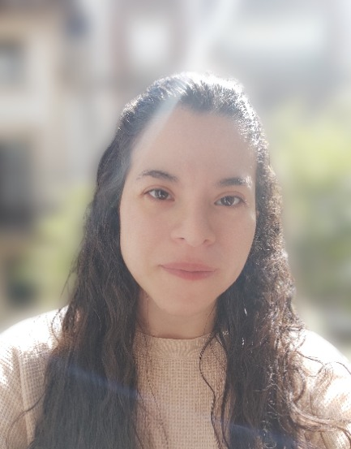
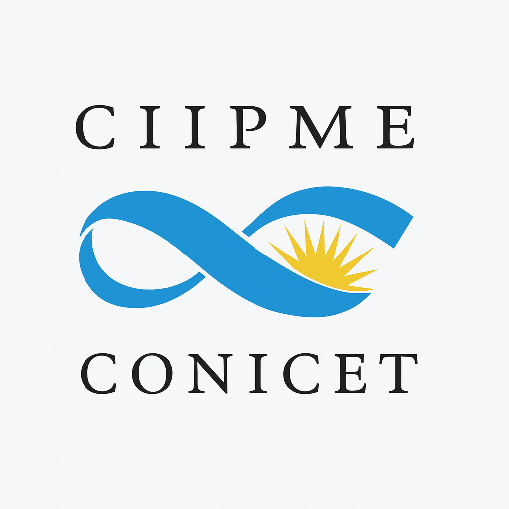

## ¡Nuevo meetup de RLadies Buenos Aires!


📅 **Fecha:** viernes 15 de mayo, 2026

🕕 **Horario:** 18:00 a 20:00hs (UTC -3 Hora Buenos Aires)

📍 **Presencial:** CIIPME - Tte. Gral. Juan Domingo Perón 2158, CABA


[**Inscripción aquí**](https://www.meetup.com/rladies-buenos-aires/events/314530835/?slug=rladies-buenos-aires&eventId=314530835)

## Materiales

- [Diapositivas](https://github.com/RLadies-BA/TRI-psicometria/blob/main/RLadies_TRI_Diapositivas.pdf)
- [Script de R](https://github.com/RLadies-BA/TRI-psicometria/blob/main/Script.R)


## 🎯 Objetivo del taller

En este taller presencial, introductorio vamos a acercarnos a la Teoría de Respuesta al Ítem (TRI) de una manera práctica y accesible. La TRI sirve para entender mejor cómo funcionan los ítems (preguntas) de un test y cómo miden una habilidad o rasgo. Nos permite ver, por ejemplo, si un ítem es más fácil o más difícil, si discrimina bien entre personas con distinto nivel, y si funciona de manera consistente. También es una herramienta muy útil para seleccionar los mejores ítems, acortar tests sin perder calidad y diseñar escalas más precisas, especialmente en contextos de desarrollo y adaptación de instrumentos.

A lo largo del encuentro, vas a construir una comprensión conceptual de sus ideas principales (sin necesidad de experiencia previa en TRI), y vas a ver cómo aplicarlas en la práctica usando R. Además, vamos a trabajar en cómo interpretar los resultados de forma intuitiva, para entender mejor cómo funcionan los ítems y qué aportan a la medición.

La idea es que te lleves una primera caja de herramientas para empezar a usar TRI en contextos de evaluación, construcción o adaptación de escalas.


## 📚 ¿Qué vas a aprender?

Durante este taller, vas a aprender:

-   Los conceptos básicos de la Teoría de Respuesta al Ítem (TRI) y en qué contextos se utiliza

-   Cómo interpretar los parámetros básicos

-   Cómo ajustar modelos de TRI en R utilizando el paquete mirt

-   Cómo visualizar e interpretar curvas características de ítems y del test

## 🧰 Requisitos técnicos

Es muy importante que tengas el entorno configurado antes del taller para poder seguirlo sin inconvenientes. Si tenés dudas, escribinos a [rladiesba\@gmail.com](mailto:jesica.formoso@gmail.com).

1.  **R (versión 4.5.1) o +**

Para actualizar R:

```{r, eval=FALSE}

install.packages("installr")
library(installr)
updateR()

```

2.  **RStudio (versión 2025.05.1) o +**

Descargá e instalá la última versión desde:

👉 <https://posit.co/download/rstudio-desktop/>

Luego, verificá que RStudio esté usando la versión más reciente de R. En la consola de RStudio, escribí:

```{r}

version

```

::: {.callout-tip icon="gear" title="Cómo cambiar la versión de R en RStudio"}
Si RStudio no está usando la versión más reciente de R que instalaste, seguí estos pasos:

a.  Abrí el menú **Herramientas / Tools**

b.  Seleccioná **Opciones globales / Global Options**

c.  En la pestaña **General**, buscá el campo **Versión de R**

d.  Elegí la versión más reciente disponible

e.  Hacé clic en **Apply** y luego en **OK**
:::

3.  **Paquetes de R necesarios**

```{r, eval=FALSE}

install.packages(c("tidyverse","mirt", "lmt"))

```

## Instructora

{style="float:left;padding: 0 10px 0 0; border-radius:50%" width="149"}

[Sofía Ortiz](https://www.linkedin.com/in/ortizsofia/) es Doctoranda en Psicología en CIIPME-CONICET y cursa la Especialización en Ciencia de Datos Aplicada a la Psicología y Ciencias del Comportamiento en la Universidad de Buenos Aires (UBA). Se desempeña como docente de grado y posgrado en la Facultad de Psicología de la UBA y en FLACSO, y se interesa por la investigación en psicología cognitiva, la psicometría y el análisis de datos.

## 🤝 Código de conducta

Todas las personas que participan en nuestro taller deben estar de acuerdo con el [código de conducta de RLadies](https://github.com/rladies/.github/blob/master/CODE_OF_CONDUCT.md#spanish).


## Agradecimientos

Este taller fue auspiciado por:

[{width="100"}](https://rladies.org/)


[{width="366"}](https://r-consortium.org/)


y un agradecimiento especial al [Centro Interdisciplinario de Investigaciones en Psicología Matemática y Experimental "Dr. Horacio J. A. Rimoldi"-CONICET](https://www.ciipme-conicet.gov.ar/wordpress/) por facilitarnos un espacio para los encuentros presenciales y por acompañar en la difusión de nuestros
talleres.

{width="185"}

## Licencia

© 2026 Sofía Ortiz

Estos materiales están publicados bajo la licencia [Creative Commons Attribution 4.0 International (CC BY 4.0)](http://creativecommons.org/licenses/by/4.0/), la cual implica que podés compartir y adaptar el material siempre que reconozcas la autoría de forma adecuada.

 
